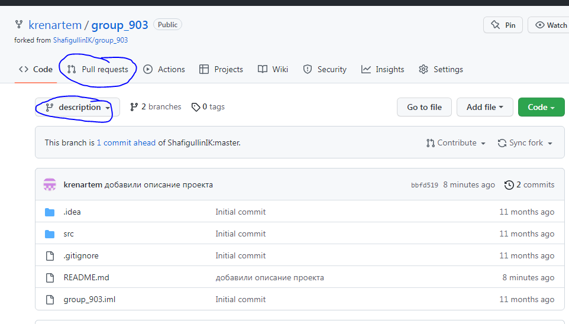
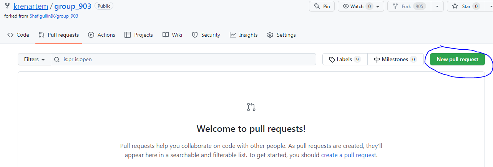
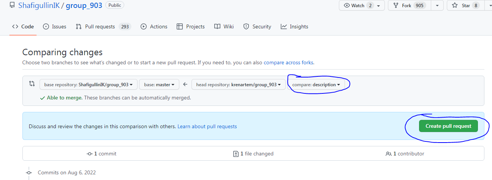
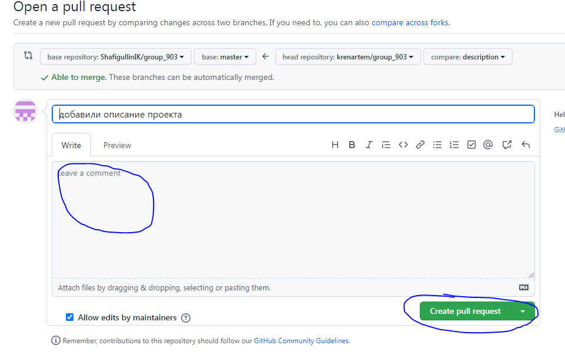
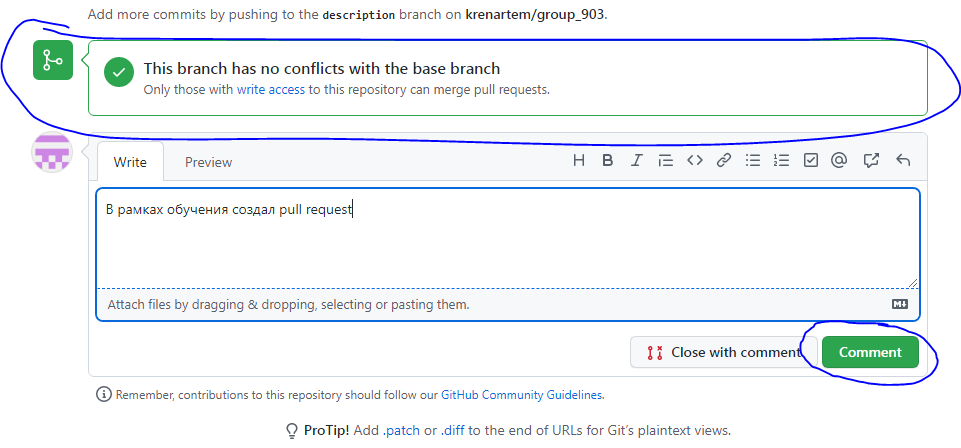

Это какой-то проект на GitHub аккаунте

Сделали Fork интересуещго репозитория в свой акааунт

Сделали git clone для нашей версии репозитория

добавляем ветку с предалагемымми изменениями

производим все изменения только в этой ветке

отправляем эти изменения на свой аккаунт (git push)

После этого на GitHub направляем pull request владельцу проекта

как предложить проект владельцу изначального репозитория:

Перейти на новую ветку, которую мы создали

нажать *New pull request*

выбрать новую ветку и нажать *Create pull request*

заполнить поле для комментария и нажать на кнопку создания запроса

GitHub проверит конфликты и можно добавить дополнительные комментарии к запросу

в своей ветке можно еще добавить файлы. Главное, не забыть добавить коммит, что файлы добавлены. Тогда в инструкции будут картинки)))
